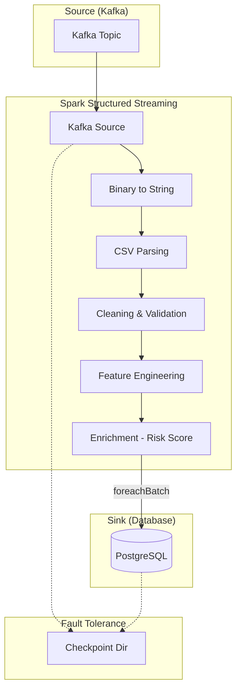

# 🚀 Consumer.scala - Trace d'Exécution Spark Streaming

## 📋 Vue d'ensemble

Le `Consumer.scala` est un **consommateur de streaming structuré** (Structured Streaming) qui écoute un topic Kafka, nettoie et enrichit les données en temps réel, puis les sauvegarde dans une base de données **PostgreSQL**.

---

## 📈 Trace d'Exécution du Stream

### ⏱️ Cycle de Vie d'un Micro-Batch

```
ÉTAPE 1 : Initialisation & Connexion Kafka
└─ Durée : ~2-3s (Une seule fois au démarrage)

ÉTAPE 2 : Déclenchement Micro-Batch (Toutes les 5s)
├─ Trigger : ProcessingTime("5 seconds")
└─ Offsets : Récupération des nouveaux messages Kafka

ÉTAPE 3 : Pipeline de Transformation (DAG)
├─ Transformation 1 : Parsing CSV (from_csv)
├─ Transformation 2 : Nettoyage (Filtres & Validations)
└─ Transformation 3 : Enrichissement (Calcul Risk Score)

ÉTAPE 4 : Sink (Écriture PostgreSQL)
├─ ForeachBatch : Écriture JDBC
└─ Checkpointing : Sauvegarde de l'état (Offset commit)

ÉTAPE 5 : Attente prochain Trigger
└─ Durée : Jusqu'à la prochaine fenêtre de 5s
```

---

## 🔍 Détail des Étapes de Transformation

### 1️⃣ Parsing & Nettoyage des Données
Spark transforme le flux binaire de Kafka en un DataFrame structuré.

```scala
.select(
  col("key"),
  from_csv(col("value"), schema, Map.empty[String, String]).as("data"),
  col("timestamp").as("kafka_timestamp")
)
```

**📊 Trace interne :**
- `CAST(value AS STRING)` : Conversion du binaire Kafka.
- `from_csv` : Application du schéma (25 colonnes).
- `filter(col("ID").isNotNull)` : Élimination des records corrompus.

### 2️⃣ Enrichissement & Feature Engineering
Calcul de nouvelles métriques pour l'analyse en aval.

| Colonne | Calcul / Logique | Utilité |
|-----------|------------------|---------|
| `Total_Screen_Time` | Social + Gaming + Education | Vue globale de l'usage |
| `Sleep_Deficit` | Recommandation (9h ou 8h) - Réel | Impact sur la santé |
| `Risk_Score` | (Usage*2 + Check/10 + BedTime*1.5 - Sport*2) / 5 | Score pondéré d'addiction |
| `Health_Category` | LOW / MODERATE / HIGH RISK | Segmentation métier rapide |

---

## 📊 Détail des Jobs Spark (Micro-Batch N)

| Job | Stage | Description | Action |
|-----|-------|-------------|--------|
| **Job X** | Stage 0 | SCAN Kafka (Read New Offsets) | `readStream` |
| **Job X+1** | Stage 1 | PARSE + CLEAN + CALCULATE | `foreachBatch` |
| **Job X+1** | Stage 2 | JDBC WRITE to PostgreSQL | `batchDF.write.jdbc` |

**🎯 Optimisations activées :**
- `spark.streaming.stopGracefullyOnShutdown` : Assure qu'aucun batch n'est coupé brutalement.
- `maxOffsetsPerTrigger=1000` : Protection contre les pics de charge (Backpressure).
- `checkpointLocation` : Tolérance aux pannes (Reprise exacte là où le stream s'est arrêté).

---

## 🔄 Flux de Données Complet



---

## 📈 Analyse de Performance

| Phase | Complexité | Impact Performance |
|-------|------------|-------------------|
| **Lecture Kafka** | Faible | Dépend du network et du nombre de partitions. |
| **Parsing CSV** | Moyenne | CPU intensive pour les gros volumes. |
| **Calcul Risk Score** | Faible | Opérations arithmétiques simples. |
| **JDBC Sink** | Élevée | Le goulot d'étranglement principal (I/O base de données). |

> [!TIP]
> **Le secret de la performance** : `spark.sql.shuffle.partitions=4` est configuré pour éviter de créer trop de petites tâches lors de l'écriture JDBC, ce qui accélère l'envoi vers PostgreSQL dans ce contexte de petits batches.

---

## 🛡️ Résilience & Checkpointing

Le stream utilise un répertoire de **checkpoint**. En cas de crash :
1. Spark lit le fichier d'offset dans `/checkpoint/consumer/offsets/`.
2. Il identifie les messages Kafka non encore commités en base de données.
3. Il redémarre exactement à partir de cet offset.
4. **Garantie** : *At-least-once processing* (ou *Exactly-once* si le sink est idempotent).
